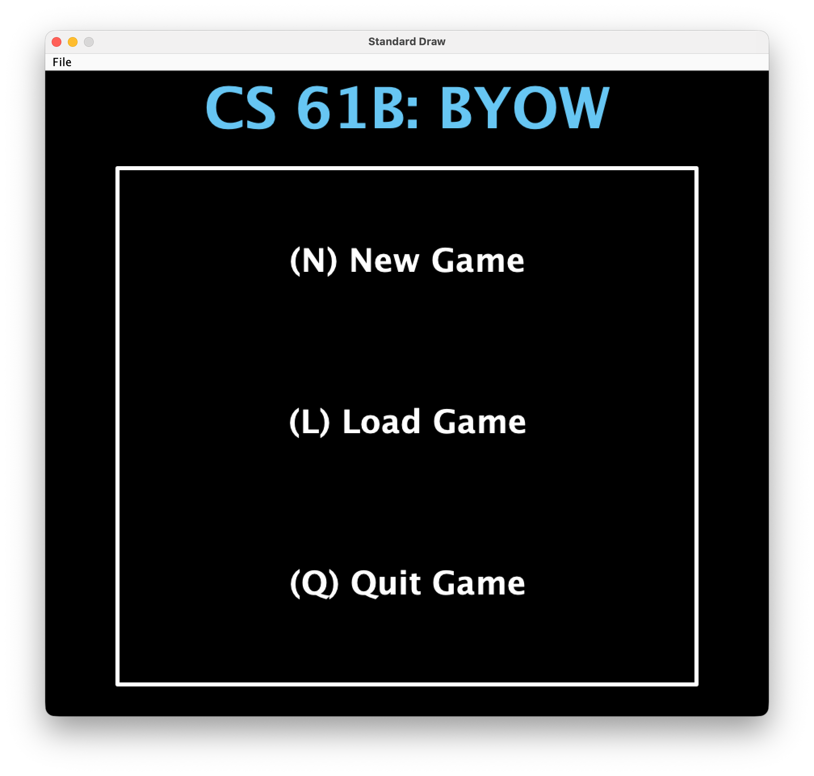
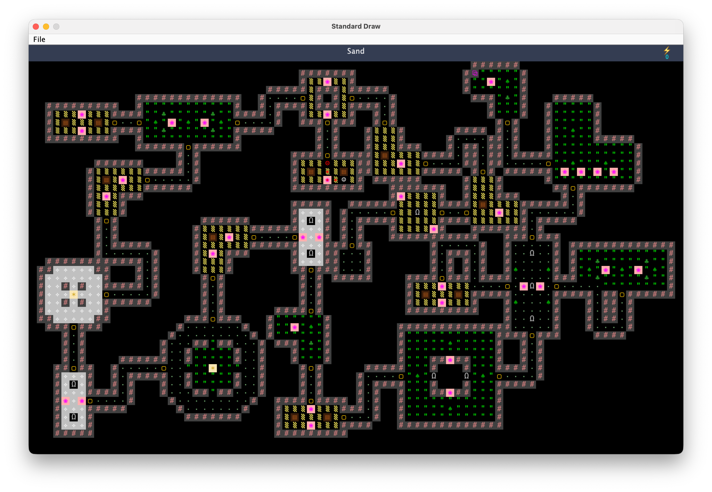

## CS61B BYOW – Dungeon Escape with Chaser AI

A Java-based roguelike-style dungeon game built for the CS61B *Build Your Own World (BYOW)* project.  
The game generates a random dungeon from a seed, lets the player explore rooms and corridors, and introduces a pathfinding enemy (“Chaser”) that hunts the player while the player tries to reach a portal to clear the game.

The code showcases:
- **Procedural dungeon generation** (rooms + branching corridors)
- **Pathfinding AI** with BFS
- **Interactive HUD & tile inspection**
- **Save / load system** to resume runs

---

## Screenshots

- **Main menu**

  

- **Generated dungeon example**

  

---

## Features

- **Seed-based world generation**
  - Enter a numeric seed to generate a reproducible world.
  - Choose between **Small**, **Medium**, and **Big** world sizes.

- **Room & corridor dungeon layout**
  - Starting room is centered in the world.
  - Random corridors (with turns) expand the dungeon.
  - New rooms are attached at corridor ends if they fit without overlapping.

- **Player controls**
  - **Main menu**
    - `N` – Start a **New Game**
    - `L` – **Load Game** from `savefile.txt`
    - `Q` – Quit
  - **In-game**
    - `W / A / S / D` – Move the player
    - `:` then `Q` – Save game and quit (`:Q` sequence)
    - `P` – Toggle visibility of the chaser’s path
    - `I` – Interact with tiles in front of the player
      - Open **treasure chests** (gain push charges)
      - Unlock **locked doors**
      - Activate **portal** to clear the game
    - `Space` – Use **push ability** to knock the chaser away (consumes a charge)
    - Mouse hover – HUD shows the tile name and tag under the cursor

- **Chaser enemy with BFS pathfinding**
  - Spawns at a random walkable tile far enough from the player.
  - Uses **Breadth-First Search** (`Pathfinder`) to navigate around walls and obstacles.
  - Can optionally display its current path overlayed on the map.
  - Handles collision cases, including:
    - Chaser steps onto the player
    - Player steps onto the chaser
    - Player and chaser swap positions in a single turn

- **HUD and UX**
  - Top HUD bar shows:
    - Tile name & category tag (e.g., `dangerous`, `interactable`, `unwalkable`)
    - Contextual prompts: “Press I to Interact”, “Press Space to Push”
    - Push ability icon and remaining charges
  - Dedicated **GAME OVER** and **CLEAR!** screens.

- **Save / Load system**
  - `SaveLoad` serializes:
    - World tile map
    - Player position, facing direction, tile under the player, push-ability count
    - Chaser position and underlying tile (newer format)
  - Saves to `savefile.txt` in the project root.
  - Backwards-compatible with older save formats.

---

## Project Structure

- `proj5/src/core`
  - `Main.java` – Minimal entry point that delegates to `World`.
  - `World.java` – Orchestrates the game:
    - Main menu and user input loop
    - World size selection and seed verification
    - Game loop (player input, chaser movement, HUD updates)
    - Collision detection, clear/game-over screens.
  - `WorldGenerator.java` – Procedural world generation:
    - Places starting room
    - Grows corridors and attaches additional rooms
    - Tracks occupied floor tiles and connected doors
    - Places player, chaser, and portal.
  - `Player.java` – Player state (position, facing direction, tile under player, push ability).
  - `Chaser.java` – Enemy state (position, previous position, path, tile under chaser).
  - `Pathfinder.java` – BFS pathfinding between two points in the tile grid.
  - `SaveLoad.java` – Save/load implementation using a simple text format.
  - `Room`, `RoomTemplate`, `RoomTemplates`, `RoomType` – Room templates and placement logic.

- `proj5/src/tileengine`
  - `TETile`, `TERenderer`, `Tileset` – CS61B rendering engine and predefined tiles.

- `proj5/src/demo`
  - Small demo programs such as `GameLoopDemo` and `RandomWorldDemo` that showcase the tile engine and input handling.

- `proj5/src/utils`
  - `RandomUtils` – Utility wrapper for random number generation.
  - `FileUtils` – Utility wrapper for reading/writing files (used by `SaveLoad`).

---

## How to Run

### Prerequisites

- **Java** 17 (or later) JDK installed.
- **CS61B / Princeton StdDraw environment** (or equivalent):
  - The project uses `edu.princeton.cs.algs4.StdDraw`.
  - Make sure the `algs4.jar` (or the CS61B course support library) is on your classpath.

### From an IDE (recommended)

1. Open the project in your Java IDE (IntelliJ, VS Code, etc.).
2. Mark `proj5/src` as a **source root**.
3. Add the `algs4.jar` (or CS61B support library) to the **project classpath**.
4. Run the `Main` class in `core`:
   - Main class: `core.Main`

### From the command line

Adjust the classpath (`-cp`) to point to where your `algs4.jar` (or equivalent) lives.

```bash
cd fa25-proj5c-new-g361

# Example (update the path to algs4.jar as needed)
javac -cp "proj5/src:lib/algs4.jar" proj5/src/core/Main.java
java  -cp "proj5/src:lib/algs4.jar" core.Main
```

If you use a different directory layout for libraries, update `lib/algs4.jar` accordingly.

---

## Gameplay Summary

- Start the game:
  - Run `core.Main`.
  - In the main menu, press `N` to create a new world.
  - Type a numeric seed (sequence of digits) and press `S`.
  - Choose a world size (`S`, `M`, `B`) or cancel (`N`) to go back.

- Survive and escape:
  - Move with `W/A/S/D`.
  - Explore rooms and corridors generated from your seed.
  - Avoid the **Chaser** – it uses BFS to chase you.
  - Collect **treasure chests** to increase your **push ability** charges.
  - Use `Space` near the chaser to push it away.
  - Reach and interact (`I`) with the **portal** tile to clear the game.

- Saving and loading:
  - In-game, press `:` then `Q` to **save and quit**.
  - From the main menu, press `L` to **load** the last saved game from `savefile.txt`.

---

## What This Project Demonstrates

This project is a good portfolio piece for:

- **Algorithmic thinking**
  - BFS pathfinding for enemy AI.
  - Procedural generation with constraints (non-overlapping rooms, corridors within bounds).

- **Object-oriented design**
  - Separation of concerns between rendering, world generation, game loop, and entities.

- **State management & serialization**
  - Custom text-based save format.
  - Backwards-compatible loading logic.

If you’re reviewing this repo as part of my portfolio and would like to discuss the design or extensions (e.g., additional enemies, items, combat, or UI polish), feel free to reach out.

